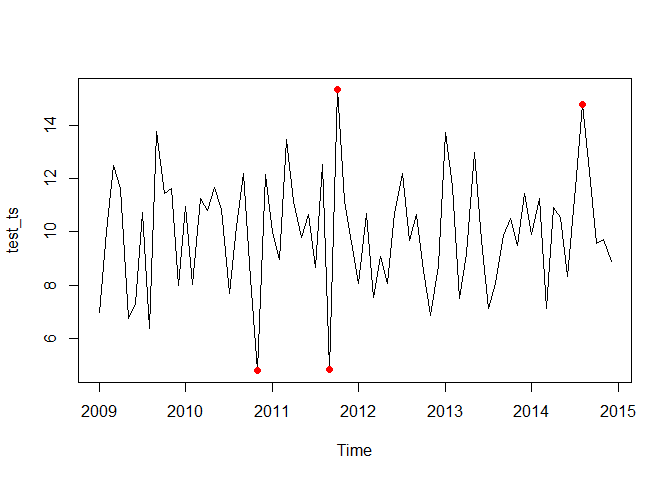
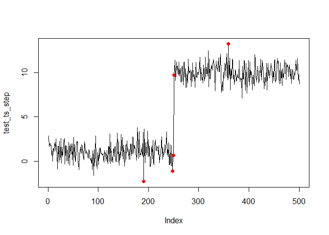

<!-- README.md is generated from README.Rmd. Please edit that file -->

# spectralAnomaly <a href="https://al-obrien.github.io/spectralAnomaly/"></a>

<!-- badges: start -->

[](https://CRAN.R-project.org/package=spectralAnomaly)
[](https://cran.r-project.org/web/checks/check_results_spectralAnomaly.html)
[](https://github.com/al-obrien/spectralAnomaly/actions/workflows/R-CMD-check.yaml)
[](https://cran.r-project.org/package=spectralAnomaly)
[](https://cran.r-project.org/package=spectralAnomaly)
[](https://app.codecov.io/gh/al-obrien/spectralAnomaly)
<!-- badges: end -->

The {spectralAnomaly} package is a simple set of tools for R users to
detect anomalies in data, such as a time series, using the ‘Spectral
Residual’ method.

## Installation

The {spectralAnomaly} can be installed directly from CRAN:

``` r
install.packages('spectralAnomaly')
```

You can also install the latest development version of {spectralAnomaly}
like so:

``` r
remotes::install_github('al-obrien/spectralAnomaly')
```

## Examples

``` r
library(spectralAnomaly)
```

### Create a noisy time series with a modest anomaly threshold

``` r
test_ts <- ts(rnorm(12*6,10,2), start=c(2009, 1), end=c(2014, 12), frequency=12)
ts_scores <- anomaly_score(test_ts, score_window = 25)
plot(test_ts, type = 'l')
points(test_ts, col = ifelse(ts_scores > quantile(ts_scores, prob = 0.95),'red',NA), pch = 16)
```



### Create a series with a step

``` r
test_ts_step <- c(rnorm(1, 1, n=250),
                  rnorm(10, 1, n=250))
ts_scores <- anomaly_score(test_ts_step, score_window = 100)
plot(test_ts_step, type = 'l')
points(test_ts_step, col = ifelse(ts_scores > quantile(ts_scores, prob = 0.99),'red',NA), pch = 16)
```



## References

1.  [Time-Series Anomaly Detection Service at
    Microsoft](https://arxiv.org/pdf/1906.03821)  
2.  [ML-based Anomaly
    Detection](https://github.com/y-bar/ml-based-anomaly-detection/tree/master)  
3.  [Saliency
    Detection](http://www.houxiaodi.com/assets/papers/cvpr07.pdf)  
4.  [anomalydetector](https://github.com/microsoft/anomalydetector/tree/master)
