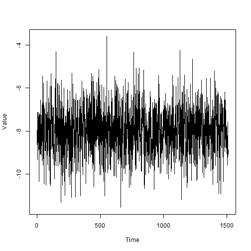
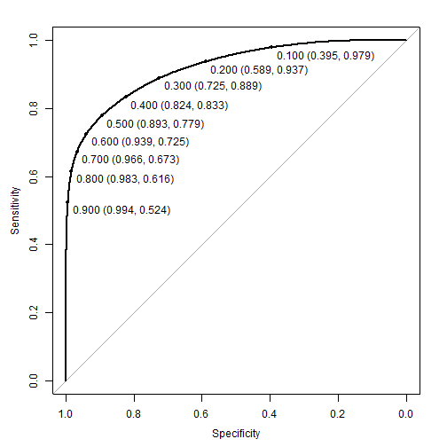
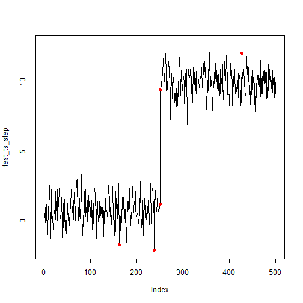
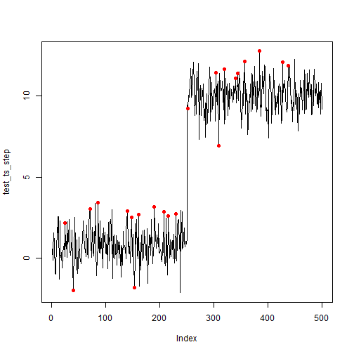

## Getting started

Although the spectral residual (SR) algorithm can do a good job of spotting anomalies in a time series, it requires the user to set a threshold. To improve this method, the SR can be paired with a Convolutional Neural Network (CNN). The excellent {torch} and {luz} packages makes this feasible to do entirely in R (no Python installation required). The example below is a starting point to building CNNs with SR.


```r
set.seed(1927)
library(spectralAnomaly)
library(torch) # For setup instructions, see pkg website!
library(luz)
```

There are a number of parameters that will be used across this article. Most of which refer to the number of samples, proportion of anomalies, and how the CNN will be run. The most important parameter is `len_window` which defines the space the model will search for anomalies.


```r
# Params
n_ts <- 1000
sr_q <- 3
len_window <- 12
n_skip <- len_window / 2 # How many steps to skip for the sliding window
anom_size <- 0.1 # Rough percentage of window to make anomalies
train_size <- 0.6
valid_size <- test_size <- 0.2
batch_size <- 32  # Number of epochs to run NN
n_epochs <- 3 # Number of epochs to run NN
```


## Simulate data

To help simulate time series data, we will use a helper function. For simplicity, the data will have the same lengths and represented as a numeric vector.


```r
create_ts <- function(fixed = TRUE, as_ts = FALSE) {
  # Simulate as if picking months between 1900 and 2025
  if(fixed) rdn <- c(1900,2025) else rdn <- sort(sample(1900:2025, 2, replace = FALSE))
  rdn_l <- diff(rdn) + 1
  rslt <- ts(rnorm(12 * rdn_l, sample(-10:10, 1),  sample(0.1:5, 1)),
             start=rdn[1],
             frequency=12)
  if(as_ts) return(rslt) else return(as.numeric(rslt))
}
```

Let's see what this looks like with default parameters.



Using `create_ts()` we will create a cohort of 1000 random time series.


```r
# Create simulated series, n times
sim_ts <- replicate(1000, create_ts(fixed = TRUE, as_ts = FALSE), simplify = FALSE)
```


## Windowing

The function below will create sliding windows and optionally inject anomalies within each window. This means the provided data will have a bunch of frames cut up with random anomalies injected within each frame. Each frame is normalized via a max-min approach to ensure better comparability.


```r
create_windows <- function(data, window, skip = 0, inject_anomalies = FALSE, prop_anom = 0.1) {

  # Internal function for lagged windows
  create_embed <- function(x, window) {
    x <- embed(x, dimension = window)[,window:1]
    x <- x[seq(1,nrow(x),by = skip + 1), ]
    t(apply(x, 1, \(y) scales::rescale(y, to = c(0, 3))))
  }

  # Apply as windows (one per row, and some skipped), normalize
  data <- lapply(data,\(x) create_embed(x, window))
  grp_len <- sapply(data, length)

   if(inject_anomalies) {
     # Inject outliers by window (transpose for required reshape)
     data_out <- lapply(data,
                        \(x) {
                          t(apply(x, 1,
                                \(y) {
                                  spectralAnomaly::add_anomaly(
                                    y, n = min(prop_anom * window, 10),
                                    score_window = 6, spec_window = window
                                  )
                                }
                              )
                            )
                          }
                        )

     # Detect outliers by window
     idx_anom <- mapply(FUN = \(x, y) x != y,
                        x = data_out, y = data,
                        SIMPLIFY = FALSE)

   } else {
    idx_anom <- NA
    data_out <- data # without injection
   }

  list(x = do.call(rbind, data_out),
       y = do.call(rbind, idx_anom),
       len = grp_len)
}
```

We use this function to add anomalies to windows from the various simulated datasets, and stack them.


```r
sim_ts_anom <-  create_windows(sim_ts,
                               window = len_window,
                               skip = n_skip,
                               inject_anomalies = TRUE,
                               prop_anom = anom_size)
```


## Prepare for {torch}

With the simulated dataset, we can prepare for dataset ingestion and define data loaders. Training, validation, and testing splits are defined to ensure the model fits can be evaluated.


```r
uni_ids <- 1:nrow(sim_ts_anom$x)
train_id <- sample(uni_ids, size = train_size * length(uni_ids))
val_id <- sample(setdiff(uni_ids, train_id), size = valid_size * length(uni_ids))
test_id <- setdiff(uni_ids, union(train_id, val_id))
```

Each data set has a saliency map operation applied, transposed, and appropriate torch variable types assigned.


```r
# Define dataset init and methods
dataset_ts <- dataset(name = 'create_torch_ds()',
                      initialize = function(df) {
                        self$x <- df$x |>
                          apply(1, \(x) saliency_map(x, window = sr_q)) |>
                          t() |>
                          torch_tensor()
                        self$y <- df$y |>
                          torch_tensor(dtype = torch_float())
                      },
                      .getitem = function(i){
                        list(x = self$x[i,], y = self$y[i,])
                      },
                      .length = function(){
                        dim(self$x)[1]
                      })

# Apply ingest process on train, val, test
ds_all <- dataset_ts(sim_ts_anom)
ds_train <- dataset_subset(ds_all, indices = train_id)
ds_val <- dataset_subset(ds_all, indices = val_id)
ds_test <- dataset_subset(ds_all, indices = test_id)

# Data loader inits
dl_ts_train <- dataloader(ds_train, shuffle = TRUE, batch_size = batch_size)
dl_ts_val <- dataloader(ds_val, shuffle = FALSE, batch_size = batch_size)
dl_ts_test <- dataloader(ds_test, shuffle = FALSE, batch_size = batch_size)
```


## Define CNN

Two 1D convolutional layers and two linear layers are stacked to create the model, as discussed in the paper by Ren et.al.


```r
cov_net <- nn_module(
  "SRCNN",
  initialize = function(len_window) {
    self$window = len_window
    self$first_conv1d <- nn_conv1d(len_window, len_window, kernel_size = 1, stride = 1, padding = 0)
    self$second_conv1d <- nn_conv1d(len_window, len_window * 2, kernel_size = 1, stride = 1, padding = 0)
    self$first_lin <- nn_linear(len_window * 2, len_window * 4)
    self$second_lin <- nn_linear(len_window * 4, len_window)
    self$relu_inplace <- nn_relu(inplace = TRUE)
  },
  forward = function(x) {
    x$view(c(x$size(1), self$window, 1)) |>
      self$first_conv1d() |>
      self$relu_inplace() |>
      self$second_conv1d() |>

      (\(x) x$view(c(x$size(1), -1)))() |> # swap back shape
      self$relu_inplace() |>
      self$first_lin() |>
      self$relu_inplace() |>
      self$second_lin() |>
      torch_sigmoid()
  }
)
```


## Light the {torch}

With the data and model defined, now we just need to provide a loss function, optimizer, and desired metrics. To account for significant class inbalance (anomalies being rare), a weighted loss function using `nn_bce_loss()` is defined. The `optim_sgd()` optimizer is used and accuracy calculated via `luz_metric_binary_accuracy()`.


```r
weighted_loss <- function(pred, lb) {
  weights <- torch_where(
    lb == 1,
      torch_tensor(1 / anom_size, dtype = torch_float32()),
    torch_tensor(1 / (1-anom_size), dtype = torch_float32())
  )
  loss_f <- nn_bce_loss(weight = weights, reduction = 'mean')
  return(loss_f(pred, lb))
}
```
Run the fit using the data, model definition, and setup parameters. Allow the model to end early.


```r
cov_net_fitted <- cov_net |>
  luz::setup(loss = weighted_loss,
             optimizer = optim_sgd,
             metrics = list(luz_metric_binary_accuracy(),
                            luz_metric_binary_auroc(100))) |>
  set_opt_hparams(lr = 1e-5, momentum = 0.9, weight_decay = 0.0) |>
  set_hparams(
    len_window = len_window
  ) |>
  fit(dl_ts_train,
      epochs = n_epochs,
      valid_data = dl_ts_val,
      callbacks = list(
        luz_callback_early_stopping(),
        luz_callback_lr_scheduler(
          lr_one_cycle,
          max_lr = 0.1,
          epochs = n_epochs,
          steps_per_epoch = length(dl_ts_train),
          call_on = 'on_batch_end'
        )
        )
      )
```

## Model checks

### Test set

Since our model was fit with several metric callbacks, we can use the test data set with `evaluate()` to retrieve a summary.


```r
cov_net_eval <- evaluate(cov_net_fitted, dl_ts_test)
get_metrics(cov_net_eval)
#> # A tibble: 3 × 2
#>   metric value
#>   <chr>  <dbl>
#> 1 loss   0.641
#> 2 acc    0.884
#> 3 auc    0.916
```

Overall, these look pretty good; however, a visual such as a ROC curve gives us a sense of the trade off between sensitivity and selectivity at different thresholds.


```r
# Make the predictions of anomalies using test set dataloader
pred_test <- predict(cov_net_fitted, dl_ts_test)

# ROC
roc_val <- pROC::roc(
  # Raw data
  ds_all$y[test_id,] |>
    torch_flatten() |>
    as.array(),

  # Preds
  pred_test |>
    torch_flatten() |>
    as.array()
  )

plot(roc_val, print.thres = seq(0.1, 0.9, by = 0.1))
```




### Other examples

Let's compare this output to a similar dataset shown in other vignettes that did not use CNNs.


```r
test_ts_step <- c(rnorm(1, 1, n=250),
                  rnorm(10, 1, n=250))
```

First, we will review what it looks by picking an arbitrarily high threshold with just `anomaly_score()` (i.e. no CNN components).


```r
ts_scores <- anomaly_score(test_ts_step, score_window = 100)

plot(test_ts_step, type = 'l')
points(test_ts_step, col = ifelse(ts_scores > quantile(ts_scores, prob = 0.99),'red',NA), pch = 16)
```



Now, we apply the same input into the fitted SR-CNN model.


```r
# Define helper to input data into model as it expects
prepare_input <- function(data, window, batch_size) {
  data <- embed(data, window)[,window:1]
  data <- data[seq(1,nrow(data),by = 3 + 1), ]
  data <- t(apply(data, 1, \(y) scales::rescale(y, to = c(0, 3))))

  data |>
    apply(1, \(x) saliency_map(x, window = 3)) |>
    t() |>
    torch_tensor() |>
    torch::tensor_dataset() |>
    dataloader(batch_size = 32)
}

# Create predictions
newpred <- prepare_input(
  test_ts_step,
  window = len_window,
  batch_size = batch_size
  ) |>
  predict(
    newdata = _,
    cov_net_fitted
    ) |>
  as.matrix()

# Since predictions are in windows, need to stack them
idx_val <- embed(1:length(test_ts_step), len_window)[,len_window:1]
idx_val <- idx_val[seq(1,nrow(idx_val),by = 3 + 1), ]
```


```r
# Plot anomalies with probability >= 90%
anom <-  sort(idx_val[newpred >= 0.90])
plot(test_ts_step, type = 'l')
points(test_ts_step,
       col = ifelse(1:length(test_ts_step) %in% anom,'red',NA),
       pch = 16)
```



Although these results look okay, additional model tweaks could be conducted to further improve the model - such as adjusting the window length or the number of layers.

## References

1. [torch for R](https://torch.mlverse.org/packages/)
1. [Time-Series Anomaly Detection Service at Microsoft](https://arxiv.org/abs/1906.03821)
